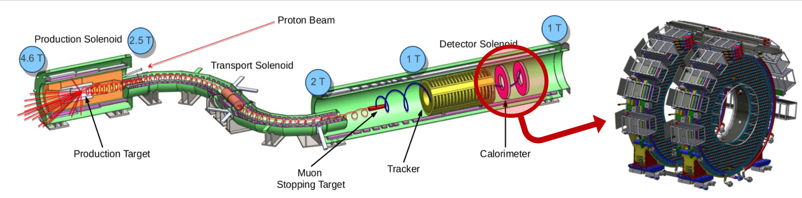

# ParticleNet implementation for Radiative Muon Capture in the Mu2e Calorimeter

Repository with an adapted version of the ParticleNet DG-CNN used to identify signal photons from Radiative Muon Capture (RMC) events in the Mu2e crystal calorimeter.

## Contents
- [Installation](#installation)
- [The Mu2e experiment and its calorimeter](#mu2e-calo) 
- [Radiative Muon Capture](#rmc)
    - [Dataset used](#data)
- [Particle Net and customization](#pnet-custom)
    - [Custom Particle Net](#pnet)
- [Model performance](#performance)
- [Other: SciKit-Learn and XGBoost classifiers ](#XGBoost)

<a name="installation"></a>
## Installation

```
    $ git clone https://github.com/elisasanzani/Software_and_Computing_Project.git
    $ cd Software_and_Computing_Project/
    $ sudo pip3 install -r requirements.txt
```
Note: while the code can be run locally, given GPU availability and requirements, I suggest using [Google Colaboratory](https://colab.research.google.com/) to have a fast performance ensured. Open the .ipynb file and select Runtime -> Change runtime -> Set harware acceleration to GPU. Data and the model are downloaded, but in a local run can be fetched locally since they are available in this repo.

<a name="mu2e-calo"></a>
## The Mu2e experiment and its calorimeter 

The [Mu2e experiment](https://arxiv.org/pdf/1901.11099.pdf) is being built at Fermilab and it will search for Charged Lepton Flavour Violation (CLFV) via the conversion process:  &mu;<sup>-</sup> + Al(27,13) &rarr; e<sup>-</sup> + Al(27,13). Mu2e will to improve the current sensitivity on the ratio between the conversion and capture events rates by four orders of magnitude, reaching a sensitivity of 8x10<sup>-17</sup> at 90% CL. <br>
A high intensity pulsed muon beam at 10 GHz is stopped on the Al target. The conversion signature is a 104.97 MeV electron. The Mu2e detectors are:
1. A high momentum resolution 3 meter long Straw Tube Tracker, made of circa 2x10<sup>4</sup> straws arranged in 36 planes, suppresses the irreducible decay in orbit background. 
2. A pure CsI Crystal Calorimeter complements the tracker information and provides excellent energy and time resolution. The Mu2e calorimeter is formed by two annular disks, each one containing 674 undoped CsI crystals (3.4x3.4x20 cm<sup>3</sup>). Each CsI crystal is readout by two UV-extended Hamamatsu Silicon Photomultipliers.
3. The entire detector region is surrounded by a Cosmic Ray Veto. 
<figure>
    
    <figcaption align="center">Fig. 1 The Mu2e experiment and its crystal calorimeter </figcaption>
</figure>


<a name="rmc"></a>
## Radiative Muon Capture
Radiative Muon Capture (RMC) occurs when a muon is absorbed in the target and a photon is emitted: &mu;<sup>-</sup> +Al(27,13) &rarr; &gamma; + &nu;<sub>&mu;</sub> + Mg(27,12).<br>
Near the endpoint, RMC photons represent a background to other Mu2e CLFV searches like &mu;<sup>-</sup> &rarr; e<sup>+</sup>.
The RMC spectrum has been measured by the TRUMPH collaboration, but high energy tails have low statistics and an independent measurement is required near the endpoint.
<figure>
    <p align="center">
    
    <figcaption>Fig. 2 The TRIUMPH RMC photon spectrum for the Mu2e target material (<sup>27</sup>Al).  </figcaption>
    </p>
</figure>

<br>
Backgrounds are due to: <br>
- Beam, called minimun bias (MNBS) <br>
- Cosmic rays <br>
The cut-based analysis that has been performed has an efficiency of around 70%.

<a name="data"></a>
### Dataset used
The used MC data are available in [main/data-PNet](https://github.com/elisasanzani/Software_and_Computing_Project/tree/main/data-PNet). 
We are interested in the high-energy region of the spectrum and beam background is too high at low-energy and low radius of the calorimeter disk. A preliminary cut has been applied to the data, requiring: E > 50MeV && R > 480 mm.<br>
There are three types of samples:
<ul>
<li>Signal: photons from RMC</li>
<li>Background: min-bias events due to the beam</li>
<li>Background: cosmic rays </li>
</ul>

<figure>
    <p align="center">
    
    <figcaption align="center">Fig. 3 Example of 1 cluster for each of the three samples.  </figcaption>
    </p>
</figure>

Each sample represents one cluster in the calorimeter and has information about the cluster and at hit-level: <br>
<ul>
<li> Point Cloud: collection of xy coordinates of each hit of a cluster, padded to a maximum of 50 hits</li>
<li>Features: collection of E & T for each cell in the cluster, padded to maximum 50 hits</li>
<li>Summary: E-T-R-N of the cluster</li>
</ul>
(E = energy (MeV), T = mean time (ns), R = centroid radius with respect to the calorimeter center (mm), N = number of active cells above the Mu2e DAQ threshold (arbitrary))

<a name="pnet-custom"></a>
## Particle Net and customization
ParticleNet is a CNN-like deep neural network for jet tagging with particle cloud data [[paper]](https://arxiv.org/pdf/1902.08570.pdf) [[GitHub repo]](https://github.com/hqucms/ParticleNet).
Jets are represented as an unordered, permutation invariant set of particles. Such representation of a jet as a particle cloud is analogous to the point cloud representation of 3D shapes used in computer vision.
This is a convolutional network with [EdgeConv](https://arxiv.org/pdf/1801.07829.pdf) blocks: graph edges are considered between each point i to its k nearest neighbours. For each point i, in this case, the EdgeConv block output has the form:
x<sub>i</sub>' = (1/k)&sum;<sup>k</sup><sub>j=1</sub> h<sub>&Theta;</sub>(x<sub>i</sub>, x<sub>i<sub>j</sub></sub> ) <br>
where h<sub>&Theta;</sub> is a parametric edge function (like RELU) and x<sub>i</sub> are the features. Like for a CNN, multiple EdgeConv filters are stacked in the same layer.

<a name="pnet"></a>
### Custom Particle Net
The custom model [[code]](https://github.com/elisasanzani/Software_and_Computing_Project/blob/main/tf_keras_model.py) is based on Particle Net Lite model, which has two EdgeConv blocks. In order to help the training, a "summary" vector (E,T,R,N) has been added and it is sent directly to the first dense layer. The last layer has been changed from softmax to sigmoid, because there are only 2 classes.
Given the very small cluster size, the number of nearest neighbours has been reduced from 7 to 3. The number of channels for each EdgeConv block has been reduced, as well as the number of neurons on the first layer. The dropout rate in the first dense layer has been increased.
All losses and metrics are weighted to match the real statistics.<br>
Model compilation parameters: <br>
- Loss: Binary Crossentropy <br>
- Metric: Area Under Precision Recall Curve (AUPRC) <br>
- Optimizer: Adam <bf>


RUN:
```
$ ipython3 PNet_RMC_main.ipynb
```
[[Colab notebook]](https://github.com/elisasanzani/Software_and_Computing_Project/blob/main/PNet_RMC_main.ipynb)


<a name="performance"></a>
## Model performance
Performance plots are shown in the [training notebook](https://github.com/elisasanzani/Software_and_Computing_Project/blob/main/PNet_RMC_main.ipynb) and saved in [images/images_PNet](https://github.com/elisasanzani/Software_and_Computing_Project/tree/main/images/images_PNet)
The network works with a AUPRC greater than 97%.
There are signs of overfitting before epoch 20 as can be seen from the train and validation loss curves.
As can be seen from the energy histogram, the high energy end-point of the RMC spectrum is free from cosmic rays.<br>
<figure>
    
    <figcaption align="center">Fig. 4 Loss and AUPRC values with respect to the epoch (top) and the best PR curve obtained (bottom).  </figcaption>
</figure>

<a name="XGBoost"></a>
## Other: SciKit-Learn and XGBoost classifiers 
Taking into consideration only min-bias background, different SciKit-Learn classifiers are trained:
- [RandomForestClassifier](https://scikit-learn.org/stable/modules/generated/sklearn.ensemble.RandomForestClassifier.html#sklearn.ensemble.RandomForestClassifier)
- [ExtraTreesClassifier](https://scikit-learn.org/stable/modules/generated/sklearn.ensemble.ExtraTreesClassifier.html?highlight=extratreesclassifier#sklearn.ensemble.ExtraTreesClassifier)
- [AdaBoostClassifier](https://scikit-learn.org/stable/modules/generated/sklearn.ensemble.AdaBoostClassifier.html#sklearn.ensemble.AdaBoostClassifier)
- [HistGradientBoostingClassifier](https://scikit-learn.org/stable/modules/generated/sklearn.ensemble.HistGradientBoostingClassifier.html?highlight=histgradientboostingclassifier#sklearn.ensemble.HistGradientBoostingClassifier)
- [DecisionTreeClassifier](https://scikit-learn.org/stable/modules/generated/sklearn.tree.DecisionTreeClassifier.html#sklearn.tree.DecisionTreeClassifier)

Also [XGBoost](https://xgboost.readthedocs.io/en/stable/python/python_intro.html) is implemented.
XGBoost (Extreme Gradient Boosting) belongs to a family of boosting algorithms and uses the gradient boosting framework and it is widely diffused thanks to its performances and also in this application it has consistently performed well (AUPRC &sim;96%).
<br>
<br>The resulting precision-recall curves are in this repo in [images/images_Classifiers](https://github.com/elisasanzani/Software_and_Computing_Project/tree/main/images/images_Classifiers)


RUN:
```
$ ipython3 XGBoost_RadiativeMuonCapture.ipynb
```
<br>Note: GPU is required. The program will stop if no GPU resources are found.


[[Colab notebook]](https://github.com/elisasanzani/Software_and_Computing_Project/blob/main/XGBoost_RadiativeMuonCapture.ipynb)
